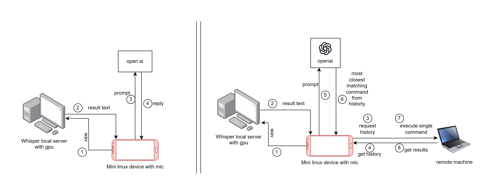

# ChatGpt always on assistant


This tool allows you to use voice to interact with a chatgpt (voice transcribe time less than 2secs) and see the result in vim/vscode/emacs. The components are modular, so each function can be used separately. 

For a better emacs version refer [emacs-chatgpt-jarvis](https://github.com/jackdoe/emacs-chatgpt-jarvis).

Uses OpenAI's Whisper (it uses it locally, your voice is not sent anywhere), press the ctrl key to start recording. Whisper will continue to transcribe your speech until you release the ctrl key. After recording, ask ChatGPT for assistance and print the output in the buffer.

It stores the recording (up to 60 seconds) in `data/jarvis-chatgpt.wav`


## Install

### Set up the openai whisper server docker on a powerful machine

[source: whisper-asr-webservice](https://github.com/ahmetoner/whisper-asr-webservice/)
```
docker pull onerahmet/openai-whisper-asr-webservice:latest-gpu

docker run -d --gpus all -p 9000:9000 -e ASR_MODEL=base -e ASR_ENGINE=openai_whisper onerahmet/openai-whisper-asr-webservice:latest-gpu
```

### You can set up the rest on a lite linux device (like a raspberry pi with mic and speaker or a linux phone)

Set the openai key in `.env`

The whisper/pyaudio/chatgpt-wrapper are a bit more involved than pip install, whisper needs ffmpeg for example, so its best to follow the instructions on their homepages:

* pip install pynput
* install https://github.com/openai/whisper
* install https://pypi.org/project/PyAudio/ (on windows its just pip install pyaudio)
* install https://github.com/mmabrouk/chatgpt-wrapper or `pip install openai` if you have an api key from openai: https://platform.openai.com/account/api-keys


```
cd src
python main.py
```